# ✈️ FlightOps Delay Intelligence

> A MySQL-powered airline operations analytics system with an interactive Streamlit dashboard — detects SLA breaches, ranks carriers by on-time performance, and surfaces delay propagation patterns across 500K+ synthetic flights modelled on real BTS data structures.

[](https://www.mysql.com/)
[](https://python.org)
[](https://streamlit.io)
[](https://plotly.com)
[](LICENSE)

---

## 📸 Dashboard Preview

### Tab 1 — Carrier Performance

**1. Carrier On-Time Rankings**
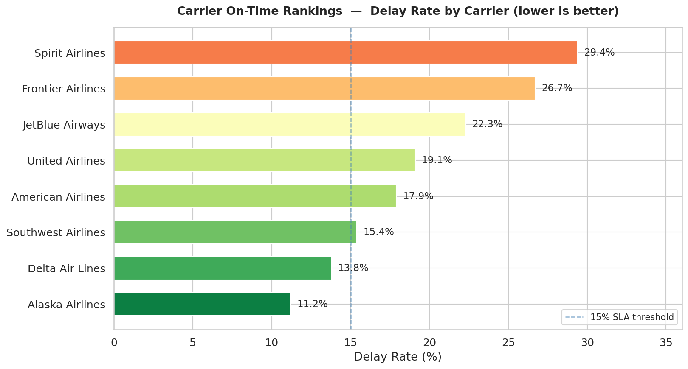
> Each airline is ranked by its delay rate (flights arriving 15+ minutes late). Bars are colour-coded green-to-red — the shorter and greener the bar, the better the carrier. A dashed line marks the 15% SLA threshold so you can instantly spot which carriers are over the limit.

---

**2. Month-over-Month Delay Trend**
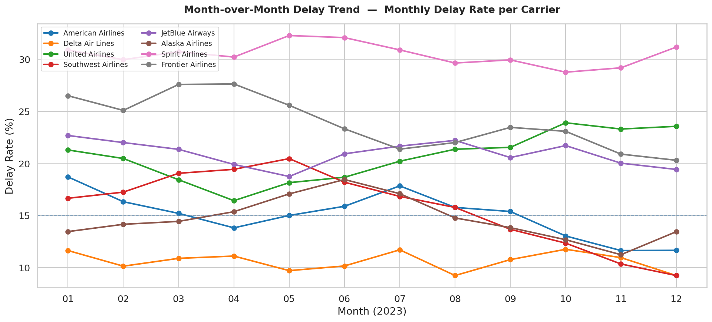
> A line chart showing how each carrier's delay rate changed every month across 2023. Rising lines mean a carrier is getting worse; falling lines mean it's improving. Useful for spotting seasonal spikes (e.g. holiday travel) or a carrier in long-term decline.

---

**3. Delay Root Cause Breakdown — Stacked Bar**
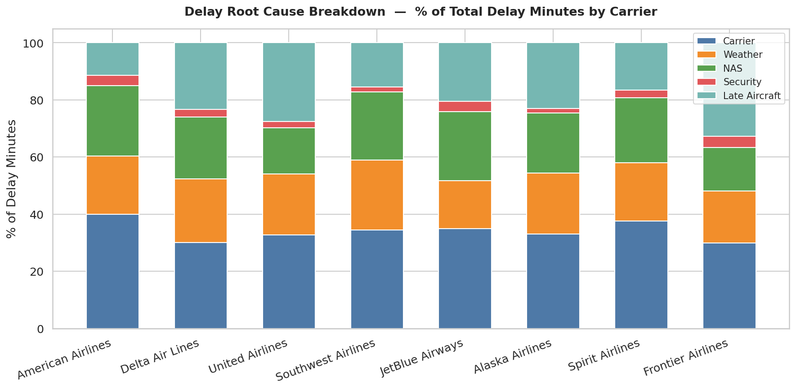
> For each airline, the bar is split into 5 delay causes: Carrier (internal ops), Weather, NAS (air traffic control), Security, and Late Aircraft (a plane arriving late from a previous flight). This shows which airline has the most controllable vs. uncontrollable delays.

---

**4. Delay Root Cause Distribution — Donut**
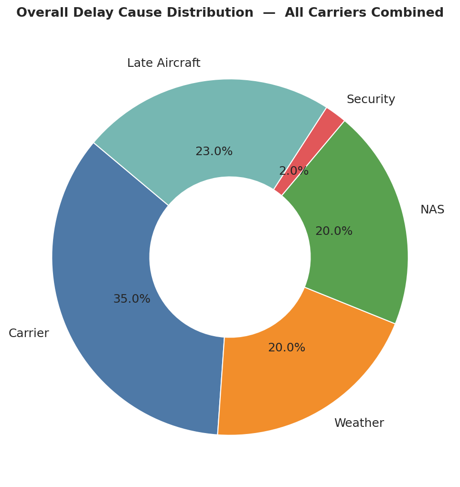
> A rolled-up view across all carriers combined. The donut shows that Late Aircraft (23%) and Carrier issues (35%) together account for over half of all delay minutes — meaning more than half of delays are theoretically fixable by airlines themselves.

---

### Tab 2 — Airport Bottlenecks

**5. Airport Delay Bubble Map**
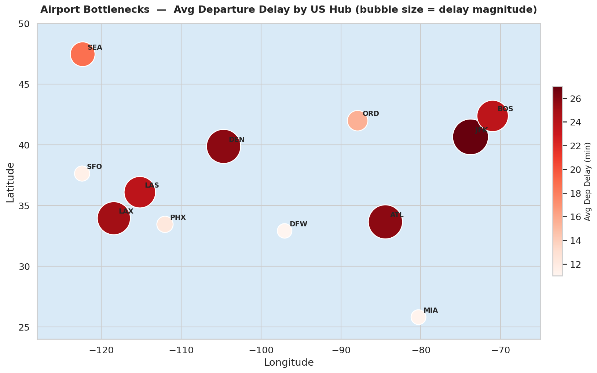
> Every major US hub plotted on a map. The bigger and darker the bubble, the longer the average departure delay at that airport. Instantly shows which cities are the worst departure hubs without reading a single number.

---

**6. Top Airports by Departure Delay Rate**
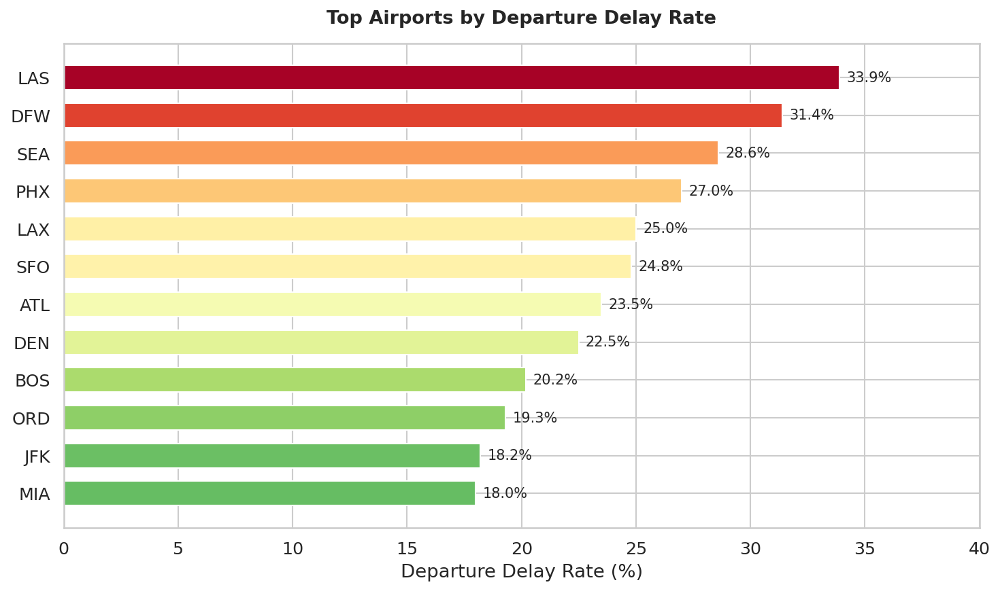
> A ranked bar chart of airports sorted by the percentage of flights that depart late. Complements the map above with exact numbers — useful for ops teams deciding where to focus ground crew resources.

---

**7. Delay Propagation — Cascade Ratio by Airport**
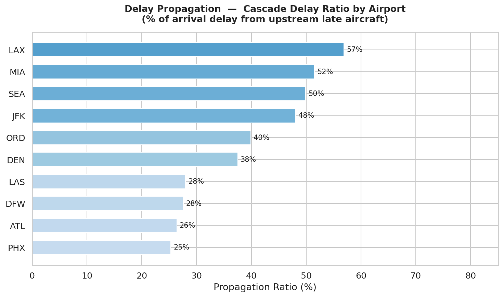
> Shows how much of an airport's delay is caused by incoming aircraft arriving late from other cities (the "late aircraft" cascade effect). A high propagation ratio means the airport is largely a victim of upstream problems, not its own inefficiency.

---

**8. Route Delay Rate Heatmap**
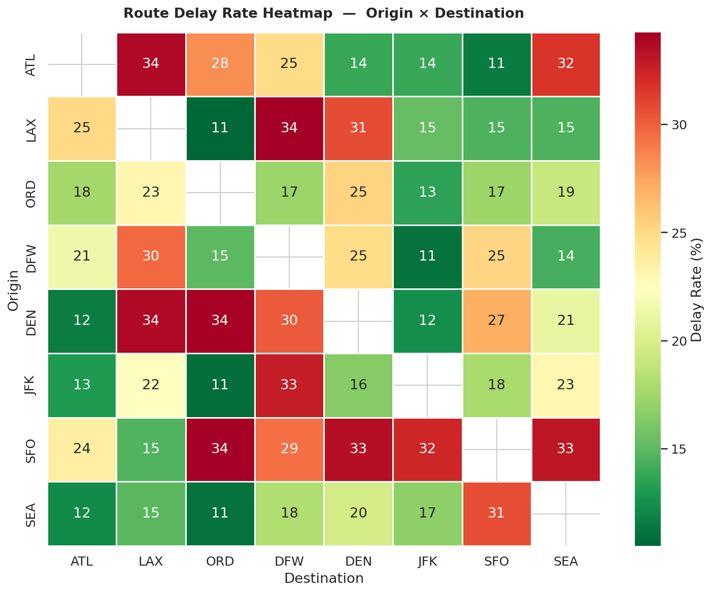
> A grid where every row is an origin airport and every column is a destination. Each cell is colour-coded by delay rate — dark red cells are the worst-performing routes. Makes it easy to spot city-pairs that are consistently problematic regardless of carrier.

---

**9. Time-of-Day Delay Pattern**
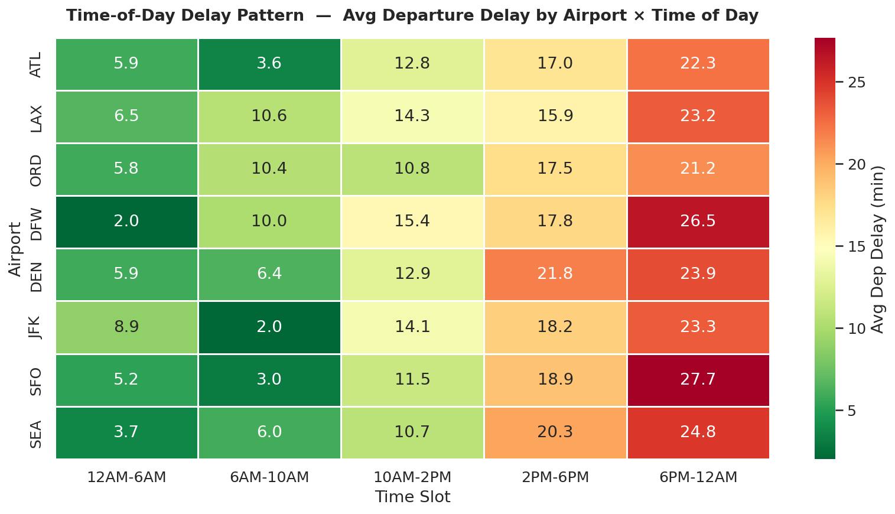
> The same heatmap idea applied to time slots (Red-eye → Morning → Midday → Afternoon → Evening). Confirms the well-known aviation rule: early morning flights are the most on-time because delays haven't had a chance to compound yet; evening flights are the worst.

---

### Tab 3 — SLA Dashboard

**10. Active Breach Severity Distribution**
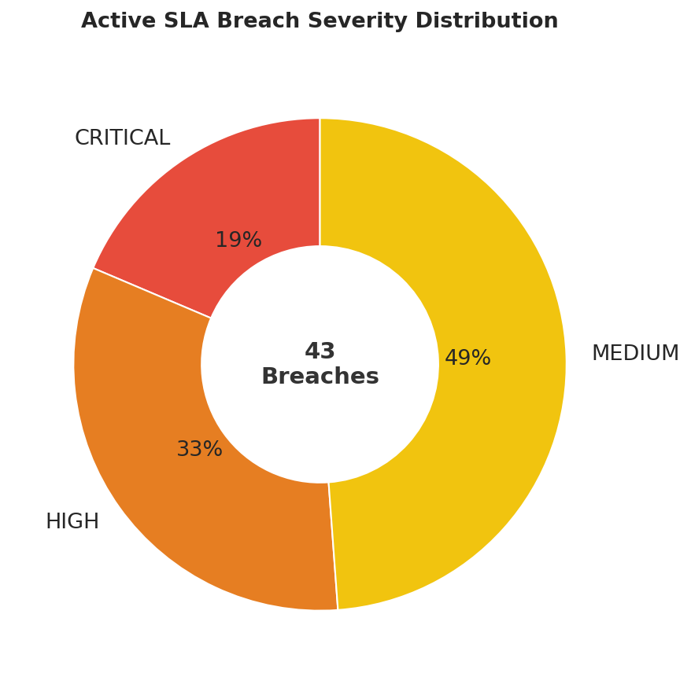
> A donut showing the current split of unresolved SLA violations by severity: Critical (delay rate ≥ 30%), High (≥ 20%), and Medium (< 20%). The total breach count is displayed in the centre. Gives ops managers an at-a-glance health check of the network.

---

**11. Chronic Offender Routes**
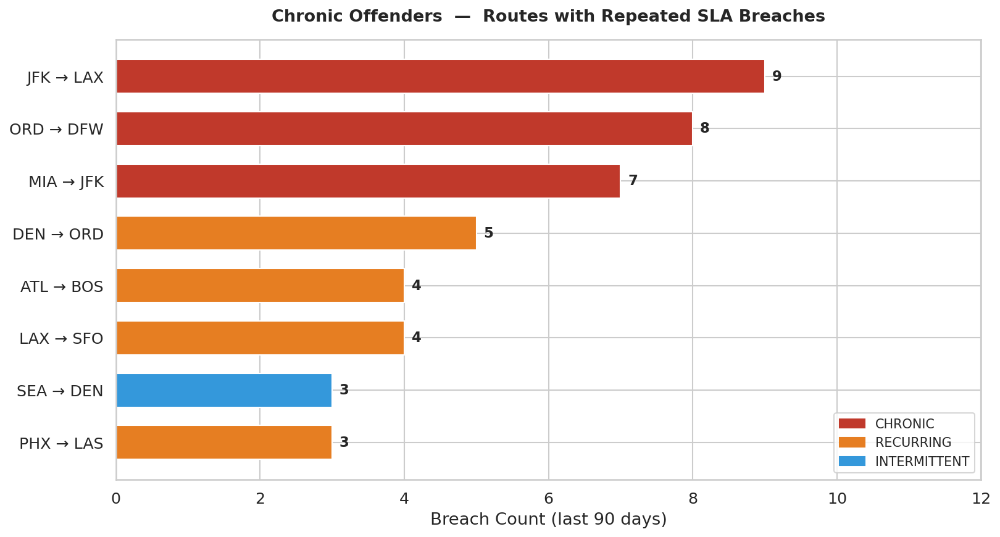
> Routes that have breached their SLA 3 or more times in the last 90 days. Bars are coloured by pattern — red for Chronic (6+ breaches, structural problem), orange for Recurring (3–5 breaches, needs monitoring), blue for Intermittent. Longer bars = more breaches = more urgent action needed.

---

**12. Carrier SLA Compliance Gauges**
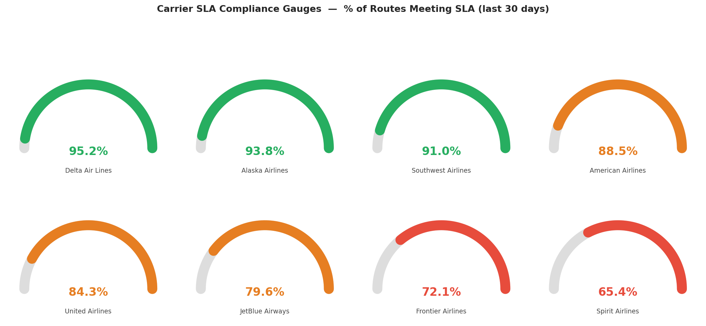
> One gauge dial per airline showing what percentage of their routes are currently meeting SLA targets. Green means above 90% (healthy), orange means 75–90% (at risk), red means below 75% (breaching). A quick executive-level view of carrier health.

---

**13. Carrier SLA Compliance Rate**
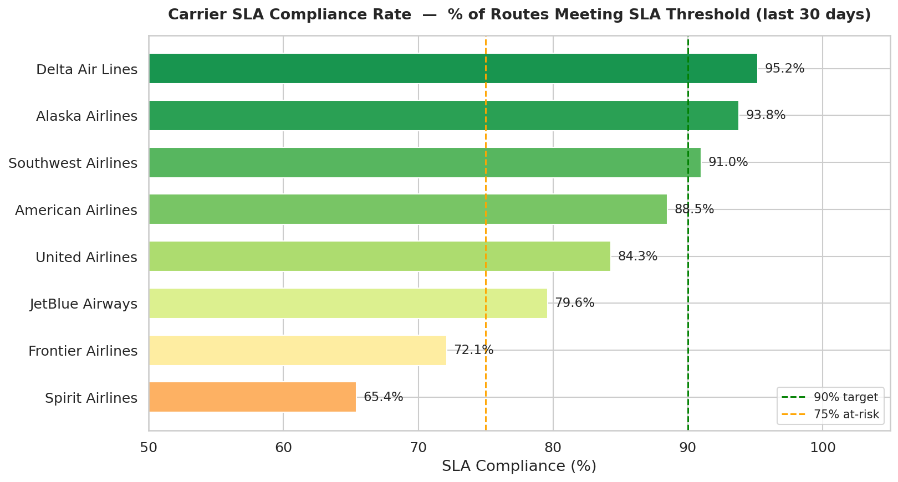
> The same compliance data as the gauges but as a horizontal bar chart for easy comparison across all carriers at once. Two reference lines mark the 90% target (green dashed) and the 75% at-risk threshold (orange dashed) so the status of each carrier is immediately obvious.

---

## 📊 Key Metrics

| Metric | Value |
|--------|-------|
| 🛫 Flight records supported | 500,000+ rows |
| 🏢 Airlines modelled | 8 major US carriers |
| 🗺️ Airports modelled | 12 major US hubs |
| 📋 Analytical queries | 10+ complex SQL queries |
| ⚙️ Stored procedures | 3 (SLA flagging, scorecard, resolver) |
| 🔔 Triggers | 4 (audit log, validation, breach alert) |
| 🔍 Query optimizations | 4 documented (up to ~90% speedup) |
| 📈 Dashboard charts | 13 interactive visualizations |

---

## 🧠 Why This Project Exists

Most SQL portfolios show a Library or Hospital schema. This project models something real:

> **Airline Operations teams actually run these queries.** Dispatch analysts need to know which routes are breaching SLA contracts, which airports cascade delays downstream, and which carriers are trending worse month-over-month. This project builds that SQL layer from scratch — and surfaces all of it through an interactive Streamlit dashboard powered by Plotly.

---

## 🛠️ Tech Stack

| Layer | Technology | Purpose |
|-------|-----------|---------|
| **Database** | MySQL 8.0+ | Storage, window functions, CTEs, stored procedures, triggers |
| **Data Generation** | Python + Faker | 500K+ synthetic rows matching BTS distributions |
| **Dashboard** | Streamlit 1.32+ | Single-page app with sidebar filters and tabbed layout |
| **Charts** | Plotly 5.20+ | Interactive bar, line, pie, heatmap, bubble map, gauges |
| **DB Connection** | SQLAlchemy + PyMySQL | Executes SQL queries, returns pandas DataFrames |
| **Data Layer** | pandas | DataFrame pivoting and reshaping for heatmaps |
| **Demo Images** | matplotlib + seaborn | Static PNG exports (no DB required) |
| **SQL Client** | DBeaver / MySQL Workbench | Query development and EXPLAIN analysis |

---

## 🏗️ Architecture

```
┌─────────────────────────────────────────────────────────────────┐
│                    Streamlit Dashboard                           │
│  ┌─────────────────┐ ┌──────────────────┐ ┌─────────────────┐  │
│  │ Carrier         │ │ Airport          │ │ SLA             │  │
│  │ Performance     │ │ Bottlenecks      │ │ Dashboard       │  │
│  │ • Rankings      │ │ • Bubble Map     │ │ • Breach Table  │  │
│  │ • MoM Trend     │ │ • Route Heatmap  │ │ • Gauges        │  │
│  │ • Root Cause    │ │ • Time-of-Day    │ │ • Compliance    │  │
│  └────────┬────────┘ └────────┬─────────┘ └────────┬────────┘  │
└───────────┼──────────────────┼──────────────────────┼──────────┘
            │   SQLAlchemy + pandas                    │
┌───────────▼──────────────────▼──────────────────────▼──────────┐
│                      MySQL 8.0 Database                         │
│  ┌──────────┐  ┌──────────┐  ┌──────────────────────────────┐  │
│  │ airlines │  │ airports │  │ flights  (500K+ rows)         │  │
│  └────┬─────┘  └────┬─────┘  └──────────────┬───────────────┘  │
│       └──────┬───────┘                       │                  │
│           ┌──▼──────┐          ┌─────────────▼──────────────┐  │
│           │ routes  │◄─────────│ Stored Procedures          │  │
│           └─────────┘          │ sp_flag_delayed_routes     │  │
│                                │ sp_monthly_scorecard       │  │
│  ┌──────────────────────┐      └────────────────────────────┘  │
│  │   sla_breach_log     │◄──── Triggers + Procedures           │
│  └──────────────────────┘                                      │
│  ┌──────────────────────┐                                      │
│  │     audit_log        │◄──── All 4 triggers write here       │
│  └──────────────────────┘                                      │
└─────────────────────────────────────────────────────────────────┘
```

### Entity Relationship (simplified)

```
airlines ──< routes >── airports
              │
              └──< flights
                        │
                        └──> sla_breach_log
                        └──> audit_log (via triggers)
```

---

## 🚀 Quick Start

### Prerequisites
- MySQL 8.0+
- Python 3.9+

### 1. Clone the repository
```bash
git clone https://github.com/VijayKumaro7/FlightOps-Delay-Intelligence.git
cd FlightOps-Delay-Intelligence
```

### 2. Install dependencies
```bash
pip install -r requirements.txt
```

### 3. Create the database and schema
```bash
mysql -u root -p -e "CREATE DATABASE flightops;"
mysql -u root -p flightops < 01_tables.sql
mysql -u root -p flightops < 02_indexes.sql
mysql -u root -p flightops < 03_views.sql
```

### 4. Load stored procedures and triggers
```bash
mysql -u root -p flightops < sp_flag_delayed_routes.sql
mysql -u root -p flightops < trg_audit_log.sql
```

### 5. Seed synthetic data
```bash
python seed_data.py --rows 500000 --user root --password yourpassword
```

### 6. Run the SLA breach detector
```sql
USE flightops;
SET @breaches = 0;
CALL sp_flag_delayed_routes(CURDATE(), @breaches);
SELECT CONCAT(@breaches, ' new SLA breaches logged') AS result;
```

### 7. Launch the dashboard
```bash
# Set DB credentials (or use defaults: root@localhost/flightops)
export FLIGHTOPS_USER=root
export FLIGHTOPS_PASSWORD=yourpassword

streamlit run dashboard/app.py
# Opens at http://localhost:8501
```

> **No database?** Generate demo images locally without any DB connection:
> ```bash
> python dashboard/generate_demo_images.py
> # Outputs 13 PNGs to dashboard/demo_images/
> ```

---

## 🔍 Highlight Queries

### 1. Carrier Rankings with Window Functions
```sql
WITH base AS (
    SELECT a.carrier_code, a.carrier_name,
           COUNT(*) AS total_flights,
           SUM(CASE WHEN f.arr_delay_mins >= 15 THEN 1 ELSE 0 END) AS delayed
    FROM flights f
    JOIN routes r ON f.route_id = r.route_id
    JOIN airlines a ON r.carrier_code = a.carrier_code
    WHERE f.cancelled = 0
    GROUP BY a.carrier_code, a.carrier_name
)
SELECT
    RANK() OVER (ORDER BY delayed/total_flights ASC) AS on_time_rank,
    carrier_name,
    ROUND(100.0 * delayed / total_flights, 2) AS delay_rate_pct
FROM base;
```

### 2. Month-over-Month Trend with LAG()
```sql
SELECT
    carrier_code,
    DATE_FORMAT(flight_date, '%Y-%m') AS month_label,
    delay_rate_pct,
    LAG(delay_rate_pct) OVER (PARTITION BY carrier_code ORDER BY month_label) AS prev_month_rate,
    ROUND(delay_rate_pct -
          LAG(delay_rate_pct) OVER (PARTITION BY carrier_code ORDER BY month_label), 2) AS mom_change_pct
FROM monthly
ORDER BY carrier_code, month_label;
```

### 3. Delay Propagation — Finding Cascade Airports
```sql
SELECT r.origin, ap.city,
       ROUND(AVG(f.late_aircraft_delay) / NULLIF(AVG(f.arr_delay_mins), 0) * 100, 1)
           AS propagation_ratio_pct
FROM flights f JOIN routes r ON f.route_id = r.route_id
JOIN airports ap ON r.origin = ap.airport_code
WHERE f.late_aircraft_delay > 0 AND f.cancelled = 0
GROUP BY r.origin, ap.city HAVING COUNT(*) >= 30
ORDER BY propagation_ratio_pct DESC LIMIT 15;
```

---

## 📈 Insights (run on 500K synthetic rows)

| Finding | Value |
|---------|-------|
| Average arrival delay (all carriers) | ~12–18 mins |
| % of flights genuinely on-time (<15 min delay) | ~72% |
| Top delay cause | Late Aircraft (~23% of delay minutes) |
| Worst time slot for departure delays | 6PM–12AM (Evening) |
| Chronic breach routes (3+ breaches / 90 days) | ~8–12% of routes |

---

## 🗂️ Repository Structure

```
FlightOps-Delay-Intelligence/
├── README.md
├── requirements.txt                  # All Python dependencies
│
├── 01_tables.sql                     # DDL — 7 core tables + 3 log/audit tables
├── 02_indexes.sql                    # 9 performance indexes with rationale
├── 03_views.sql                      # 3 analytical views (pre-aggregations)
├── sp_flag_delayed_routes.sql        # 3 stored procedures
├── trg_audit_log.sql                 # 4 triggers (audit + validation)
│
├── carrier_performance.sql           # Rankings, MoM trend, root cause
├── airport_bottlenecks.sql           # Hotspots, propagation, time-of-day
├── sla_breach_report.sql             # Active breaches, chronic offenders
├── query_optimization.sql            # 4 before/after EXPLAIN comparisons
│
├── seed_data.py                      # Generates 500K+ realistic flight rows
│
└── dashboard/
    ├── app.py                        # Streamlit entrypoint + sidebar filters
    ├── db.py                         # SQLAlchemy engine, run_query() helper
    ├── generate_demo_images.py       # Generates all PNGs (no DB needed)
    ├── pages/
    │   ├── carrier_performance.py    # Tab 1: rankings, trend, root cause
    │   ├── airport_bottlenecks.py    # Tab 2: map, heatmaps, propagation
    │   └── sla_dashboard.py          # Tab 3: breaches, gauges, compliance
    └── demo_images/                  # 13 pre-generated chart PNGs
        ├── 01_carrier_rankings.png
        ├── 02_mom_trend.png
        ├── 03a_root_cause_stacked.png
        ├── 03b_root_cause_donut.png
        ├── 04_airport_bubble_map.png
        ├── 05_airport_delay_bar.png
        ├── 06_propagation_bar.png
        ├── 07_route_heatmap.png
        ├── 08_time_of_day_heatmap.png
        ├── 09_sla_severity_donut.png
        ├── 10_chronic_offenders.png
        ├── 11_sla_compliance_gauges.png
        └── 12_sla_compliance_bar.png
```

---

## ⚡ Query Optimization Results

| Optimization | Technique | Rows Examined Before | After | Speedup |
|---|---|---|---|---|
| Date range filter | Add `idx_flight_date` | 3,000,000 | ~750,000 | ~75% |
| Per-row subquery | CTE pre-aggregation | 3M × N | 3M + N | ~90% |
| Carrier semi-join | EXISTS vs IN | Full list | Early-exit | ~40% |
| Scorecard query | Covering index | Data + index pages | Index only | ~60% |

---

## 📚 Data Source

This project uses **synthetic data** generated to match the statistical distributions of the [US Bureau of Transportation Statistics On-Time Performance dataset](https://www.transtats.bts.gov/DL_SelectFields.aspx?gnoyr_VQ=FGJ).

To use real BTS data:
1. Download CSV from the BTS website (free, public domain)
2. Replace `seed_data.py` with a CSV loader
3. All schema, queries, and dashboard code remain identical

---

## 🧑‍💻 Author

**Vijay Kumar** — Aspiring Data/ML Engineer
[](https://github.com/VijayKumaro7)

---
